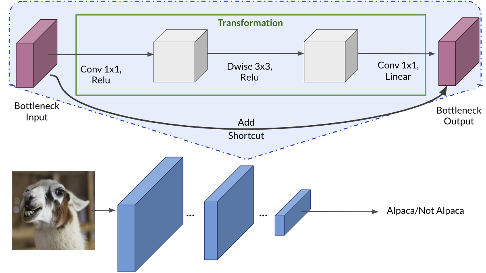

# Foundations of Convolutional Neural Networks

This repository contains the code and materials for the "Foundations of Convolutional Neural Networks" course in the Deep Learning Specialization on Coursera.

## About

Discover some powerful practical tricks and methods used in deep CNNs, straight from the research papers, then apply transfer learning to your own deep CNN. 

## Learning Objectives

- Implement the basic building blocks of ResNets in a deep neural network using Keras
- Train a state-of-the-art neural network for image classification
- Implement a skip connection in your network
- Create a dataset from a directory
- Preprocess and augment data using the Keras Sequential API
- Adapt a pretrained model to new data and train a classifier using the Functional API and MobileNet
- Fine-tine a classifier's final layers to improve accuracy

## Notes

### Residual Networks

In theory, very deep networks can represent very complex functions; but in practice, they are hard to train. Residual Networks, introduced by He et al., allow you to train much deeper networks than were previously feasible.

In recent years, neural networks have become much deeper, with state-of-the-art networks evolving from having just a few layers (e.g., AlexNet) to over a hundred layers.

- The main benefit of a very deep network is that it can represent very complex functions. It can also learn features at many different levels of abstraction, from edges (at the shallower layers, closer to the input) to very complex features (at the deeper layers, closer to the output).- 
- However, using a deeper network doesn't always help. A huge barrier to training them is vanishing gradients: very deep networks often have a gradient signal that goes to zero quickly, thus making gradient descent prohibitively slow.- 
- More specifically, during gradient descent, as you backpropagate from the final layer back to the first layer, you are multiplying by the weight matrix on each step, and thus the gradient can decrease exponentially quickly to zero (or, in rare cases, grow exponentially quickly and "explode," from gaining very large values).- 
- During training, you might therefore see the magnitude (or norm) of the gradient for the shallower layers decrease to zero very rapidly as training proceeds, as shown below:

In ResNets, a "shortcut" or a "skip connection" allows the model to skip layers. By stacking these ResNet blocks on top of each other, you can form a very deep network.

The lecture mentioned that having ResNet blocks with the shortcut also makes it very easy for one of the blocks to learn an identity function. This means that you can stack on additional ResNet blocks with little risk of harming training set performance.

On that note, there is also some evidence that the ease of learning an identity function accounts for ResNets' remarkable performance even more than skip connections help with vanishing gradients.

Two main types of blocks are used in a ResNet, depending mainly on whether the input/output dimensions are the same or different. 

####  The Identity Block

The identity block is the standard block used in ResNets, and corresponds to the case where the input activation (say 𝑎[𝑙]) has the same dimension as the output activation (say 𝑎[𝑙+2]). To speed up training, a BatchNorm step can be added. 

#### The Convolutional Block

he ResNet "convolutional block" is the second block type. You can use this type of block when the input and output dimensions don't match up. The difference with the identity block is that there is a CONV2D layer in the shortcut path:

- The CONV2D layer in the shortcut path is used to resize the input 𝑥 to a different dimension, so that the dimensions match up in the final addition needed to add the shortcut value back to the main path. (This plays a similar role as the matrix 𝑊𝑠
- discussed in lecture.)
- For example, to reduce the activation dimensions's height and width by a factor of 2, you can use a 1x1 convolution with a stride of 2.
- The CONV2D layer on the shortcut path does not use any non-linear activation function. Its main role is to just apply a (learned) linear function that reduces the dimension of the input, so that the dimensions match up for the later addition step. 

#### What you should remember:

- Very deep "plain" networks don't work in practice because vanishing gradients make them hard to train.
- Skip connections help address the Vanishing Gradient problem. They also make it easy for a ResNet block to learn an identity function.
- There are two main types of blocks: The identity block and the convolutional block.
- Very deep Residual Networks are built by stacking these blocks together.

### Transfer Learning with MobileNetV2

A pre-trained model is a network that's already been trained on a large dataset and saved, which allows you to use it to customize your own model cheaply and efficiently. 

Using prefetch() prevents a memory bottleneck that can occur when reading from disk. It sets aside some data and keeps it ready for when it's needed, by creating a source dataset from your input data, applying a transformation to preprocess it, then iterating over the dataset one element at a time. Because the iteration is streaming, the data doesn't need to fit into memory.

You can set the number of elements to prefetch manually, or you can use tf.data.experimental.AUTOTUNE to choose the parameters automatically. Autotune prompts tf.data to tune that value dynamically at runtime, by tracking the time spent in each operation and feeding those times into an optimization algorithm. The optimization algorithm tries to find the best allocation of its CPU budget across all tunable operations.

To increase diversity in the training set and help your model learn the data better, it's standard practice to augment the images by transforming them, i.e., randomly flipping and rotating them. Keras' Sequential API offers a straightforward method for these kinds of data augmentations, with built-in, customizable preprocessing layers. These layers are saved with the rest of your model and can be re-used later. 

#### What you should remember:

- When calling image_data_set_from_directory(), specify the train/val subsets and match the seeds to prevent overlap
- Use prefetch() to prevent memory bottlenecks when reading from disk
- Give your model more to learn from with simple data augmentations like rotation and flipping.
- When using a pretrained model, it's best to reuse the weights it was trained on.

MobileNetV2 was trained on ImageNet and is optimized to run on mobile and other low-power applications. It's 155 layers deep (just in case you felt the urge to plot the model yourself, prepare for a long journey!) and very efficient for object detection and image segmentation tasks, as well as classification tasks like this one. The architecture has three defining characteristics:

- Depthwise separable convolutions
- Thin input and output bottlenecks between layers
- Shortcut connections between bottleneck layers

MobileNetV2 uses depthwise separable convolutions as efficient building blocks. Traditional convolutions are often very resource-intensive, and depthwise separable convolutions are able to reduce the number of trainable parameters and operations and also speed up convolutions in two steps:

- The first step calculates an intermediate result by convolving on each of the channels independently. This is the depthwise convolution.
- In the second step, another convolution merges the outputs of the previous step into one. This gets a single result from a single feature at a time, and then is applied to all the filters in the output layer. This is the pointwise convolution, or: Shape of the depthwise convolution X Number of filters.

Each block consists of an inverted residual structure with a bottleneck at each end. These bottlenecks encode the intermediate inputs and outputs in a low dimensional space, and prevent non-linearities from destroying important information.

The shortcut connections, which are similar to the ones in traditional residual networks, serve the same purpose of speeding up training and improving predictions. These connections skip over the intermediate convolutions and connect the bottleneck layers. 

- MobileNetV2's unique features are:
    - Depthwise separable convolutions that provide lightweight feature filtering and creation
    - Input and output bottlenecks that preserve important information on either end of the block
- Depthwise separable convolutions deal with both spatial and depth (number of channels) dimensions

#### Fine-tuning the Model

You could try fine-tuning the model by re-running the optimizer in the last layers to improve accuracy. When you use a smaller learning rate, you take smaller steps to adapt it a little more closely to the new data. In transfer learning, the way you achieve this is by unfreezing the layers at the end of the network, and then re-training your model on the final layers with a very low learning rate. Adapting your learning rate to go over these layers in smaller steps can yield more fine details - and higher accuracy.

The intuition for what's happening: when the network is in its earlier stages, it trains on low-level features, like edges. In the later layers, more complex, high-level features like wispy hair or pointy ears begin to emerge. For transfer learning, the low-level features can be kept the same, as they have common features for most images. When you add new data, you generally want the high-level features to adapt to it, which is rather like letting the network learn to detect features more related to your data, such as soft fur or big teeth.

To achieve this, just unfreeze the final layers and re-run the optimizer with a smaller learning rate, while keeping all the other layers frozen.

Where the final layers actually begin is a bit arbitrary, so feel free to play around with this number a bit. The important takeaway is that the later layers are the part of your network that contain the fine details (pointy ears, hairy tails) that are more specific to your problem.

What you should remember:

- To adapt the classifier to new data: Delete the top layer, add a new classification layer, and train only on that layer
- When freezing layers, avoid keeping track of statistics (like in the batch normalization layer)
- Fine-tune the final layers of your model to capture high-level details near the end of the network and potentially improve accuracy.

